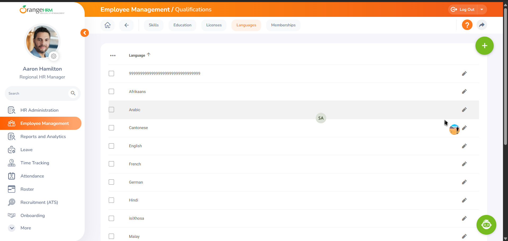
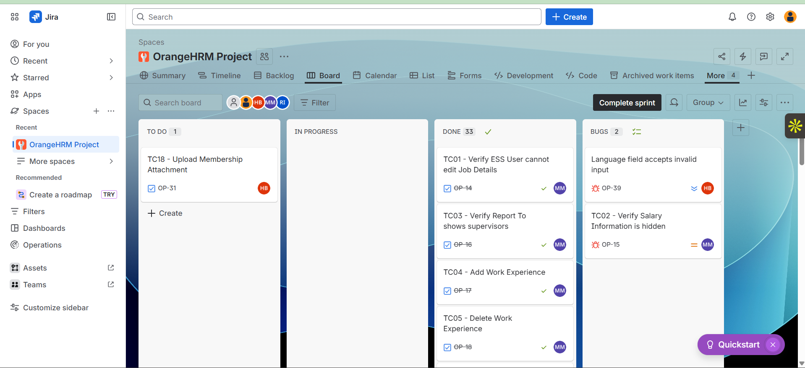
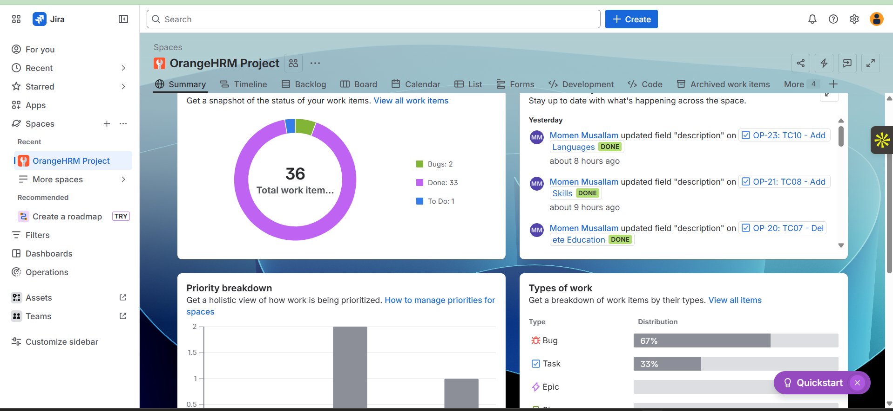
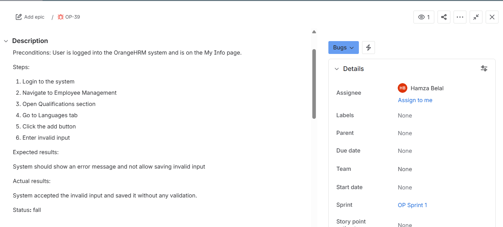
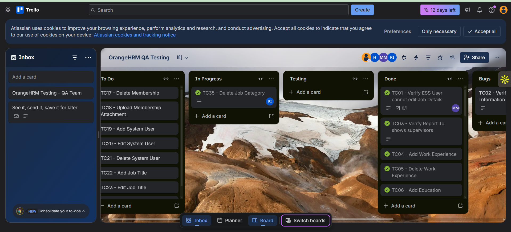

𝗢𝗿𝗮𝗻𝗴𝗲𝗛𝗥𝗠 𝗤𝗔 𝗧𝗲𝘀𝘁𝗶𝗻𝗴 𝗣𝗿𝗼𝗷𝗲𝗰𝘁

This repository contains a Manual Quality Assurance testing project conducted on the OrangeHRM system.  
The project focuses on verifying the functionality, usability, and reliability of the core HR modules in the system.

𝗣𝗿𝗼𝗷𝗲𝗰𝘁 𝗢𝘃𝗲𝗿𝘃𝗶𝗲𝘄
The objective of this project is to perform manual testing on OrangeHRM and validate its core features through structured QA documentation including:

- Test Plan
- Test Cases
- Bug Reports
- Test Summary Report
- Project Presentation

𝗧𝗲𝘀𝘁𝗶𝗻𝗴 𝗦𝗰𝗼𝗽𝗲
The following modules were tested during this QA project:

- Login / Logout
- Dashboard
- HR Administration
- Work Experience
- Education
- Skills
- Languages
- Licenses
- Attachments
- Salary
- Job Module
- Pay Grades
- Job Categories
- Employment Status
- Membership

𝗢𝘂𝘁 𝗼𝗳 𝗦𝗰𝗼𝗽𝗲
The following modules were not tested as they are not part of the free version used in this project:

- Performance Management
- Recruitment
- Attendance
- Advanced HR Analytics

𝗧𝗲𝘀𝘁𝗶𝗻𝗴 𝗧𝘆𝗽𝗲𝘀
The following testing approaches were used:

- Manual Testing
- Functional Testing
- Black Box Testing
- UI Testing
- Smoke Testing
- Exploratory Testing
- Regression Testing
- Security Testing

𝗧𝗼𝗼𝗹𝘀 𝗨𝘀𝗲𝗱

- Jira (Bug Tracking)
- Trello (Task Management)
- GitHub (Version Control)
- Excel / Google Sheets (Test Cases)
- Browser Developer Tools
- Screenshot Tools

𝗣𝗿𝗼𝗷𝗲𝗰𝘁 𝗙𝗶𝗹𝗲𝘀

This repository contains the following documents:

- Test Plan– Testing strategy, scope, and methodology
- Test Summary Report – Final testing results and statistics
- Presentation – Project explanation and testing process

𝗣𝗿𝗼𝗷𝗲𝗰𝘁 𝗟𝗶𝗻𝗸𝘀

Jira Board  
https://rawadisayed23.atlassian.net/jira/software/projects/OP/boards/67/backlog

Trello Board  
https://trello.com/b/OKamKV2K/orangehrm-qa-testing

𝗧𝗲𝘀𝘁𝗶𝗻𝗴 𝗘𝘃𝗶𝗱𝗲𝗻𝗰𝗲

OrangeHRM Dashboard

Language Module Testing

Jira Project Overview

Jira Sprint Board

Bug Report Example

Trello Testing Board

𝗧𝗲𝗮𝗺 𝗠𝗲𝗺𝗯𝗲𝗿𝘀

- Rawad Isayed
- Momen Musallam
- Hamza Belal
- Mohammed Al swaisy

𝗥𝗲𝗽𝗼𝘀𝗶𝘁𝗼𝗿𝘆 𝗣𝘂𝗿𝗽𝗼𝘀𝗲

This repository serves as documentation for the QA testing process and results for the OrangeHRM system.

